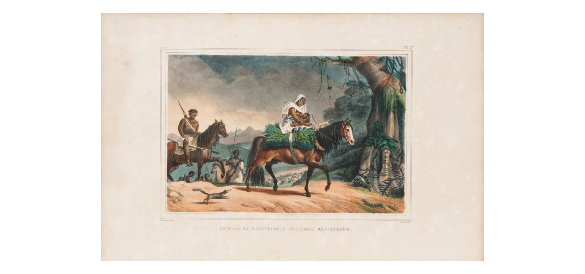

# Projeto: Imagem para Voz

[](https://colab.research.google.com/drive/1KZZsnD-CLZYzNyUT1oxNMTdf5ioaxtlM?usp=sharing)
[](https://github.com/rocdav/image2voice/blob/main/git_traduzido.ipynb)

Este projeto utiliza recursos de IA generativa para gerar descrições de imagens e convertê-las em voz.

## Estrutura do Repositório

- **inputs/**: Contém as imagens utilizadas como input.
- **outputs/**: Contém os arquivos de áudio gerados a partir das descrições.

## Como Funciona

1. O usuário faz upload de uma imagem.
2. O modelo gera uma descrição em inglês para a imagem.
3. A descrição é traduzida para o português.
4. A descrição em português é convertida em um arquivo de áudio.

## Exemplos

### Imagem de Exemplo 1

- Descrição em Português: (Descrição gerada)
- Arquivo de Áudio: [Saída 1](outputs/saida1.mp3)

### Imagem de Exemplo 2

- Descrição em Português: (Descrição gerada)
- Arquivo de Áudio: [Saída 2](outputs/saida2.mp3)

### Imagem de Exemplo 3

- Descrição em Português: (Descrição gerada)
- Arquivo de Áudio: [Saída 3](outputs/saida3.mp3)

## Insights e Possibilidades

Durante o desenvolvimento deste projeto, foi possível explorar diversas funcionalidades dos modelos de IA, incluindo processamento de linguagem natural e síntese de voz. Isso abre diversas possibilidades para aplicações como assistência a deficientes visuais, automação de descrições de conteúdo multimídia, entre outras.

## Como Executar

Para executar este projeto localmente, siga os passos abaixo:

1. Clone este repositório.
2. Instale as dependências:
   ```bash
   pip install -r requirements.txt
Execute o script principal:
bash
Copiar código
python main.py
Feito com 💻 por: Alexandre Eduardo de Souza Jesus, Davi Machado da Rocha, Eduardo Garcia de Gáspari Valdejão, Gustavo Silva de Oliveira e Thiago Shimada para a conclusão da disciplina de PLN no ICMC durante o 1º semestre de 2024.
